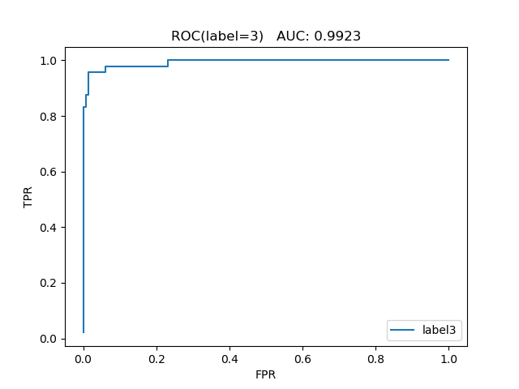

---

# 实验四：朴素贝叶斯

**姓名：**孙铭

**学号：**1711377

**专业：**计算机科学与技术

**日期：**2020年4月24日

---

## 目录

[TOC]


---


---

## 摘要

​		本次实验要求实现基于经典数据集`wine.data`的朴素贝叶斯分类器。实验要求中关于本次实验的三类要求已全部实现。本次实验代码及作业报告均由个人独立完成，整体代码均未调用sklearn中的包。具体实现功能参下。

> **实验初级要求**
>
> > （1）给定Most Popular Data Set中的wine数据集（对意大利同一地区生产的三种不同品种的酒做大量分析所得出的数据），成功实现了一个朴素贝叶斯分类器；
> >
> > （2）采用分层采样的方式将数据集划分为训练集和测试集，利用十折交叉验证法对测试集进行预测，计算分类结果平均的准确率。
>
> **实验中级要求**
>
> > 使用测试集评估模型，得到多元分类下的混淆矩阵，并计算出准确率，召回率和F值。
>
> **实验提高要求**
>
> > 在中级要求的基础上成功画出三类数据的ROC曲线，并求出相应的AUC值。

​		以上是本次实验的摘要部分，接下来将展开论述。

---

## 环境配置

​		本次作业使用语言版本为`Python 3.6.5 64bit`，处理器为`Intel(R) Core(TM) i5-8250U CPU @ 1.60GHz 1.80GHz`，项目工程文件如下。

```python
| data
|	| wine.data				# 数据集
|	| wine.names 			# 对数据集的基本介绍
| pic						# 实验结果图存放目录
| NaiveBayes.py				# 朴素贝叶斯分类器代码实现
```

​		实验过程中用到的包如下。

```python
import math							# 常用数学工具
import numpy						# 数据结构
import codecs						# 文件读写
import prettytable					# 绘制ascii表格
import matplotlib.pyplot as plt		# 绘制图像
```

​		以上是本次实验环境配置部分。

---

## 数据处理

​		本次实验所使用的数据集为`wine.data`，关于数据集的具体介绍参见`wine.names`，这里只做出重点部分介绍。

​		数据集中共有178条数据，每行由14类数据组成，其中，第一列为标签值，剩余13列为属性值。每一类标签即对应的数据量大小如下表所示。

| labels | data capacity |
| ------ | ------------- |
| 1      | 59            |
| 2      | 71            |
| 3      | 48            |

​		`wine.data`数据集文件后缀为`.data`，该格式没有现成的包能够直接处理，所以直接使用python中的`codecs.open`打开文件，将文件内容作为字符串进行处理，以逗号为分隔符分隔数据，之后将数据保存在以`numpy.array`方式定义的二维数组中即可。实现代码如下。

```python
def readfile(filename):
    with codecs.open(filename, encoding='utf-8') as f:
        _list = f.readlines()
    for i in range(0, len(_list)):
        _list[i] = _list[i].rstrip('\n')
        _list[i] = _list[i].rstrip('\r')
    data = np.array([item.split(',') for item in _list], dtype=float)	# 以逗号为分隔符分隔数据
    return data
```

​		以上是本次实验数据处理部分。

---

## 实验初级要求

​		此节将分成两个部分进行分析，其一是实现朴素贝叶斯分类器，其二是分层十折交叉验证的实现。首先进行第一个部分的介绍。

#### 1. 朴素贝叶斯分类器

​		首先介绍贝叶斯理论，以下是对PPT中内容的概述。

​		贝叶斯公式给出了从先验概率计算后验概率的方法，与之对应的极大后验概率决策规则为：
$$
C_{MAP}=argmax_{c\in C}\frac{P(x|c)P(c)}{P(x)}=argmac_{c\in C}P(x|c)P(c)
$$
​		其中，$C_{MAP}$在贝叶斯公式中也作$P(c|x)$，含义为在给定样本$x$的条件下，属于类别$c$的概率；$P(x|c)$表示假设在$c$类下，观察到样本$x$的概率，模式特征$x$的似然函数（特征$x$来自于类别$c$的可能性）；$P(c)$则表示样本为类别$c$的先验概率；而$P(x)$表示一个归一化的证据因子（比例因子），在实际计算中可以认为是一个与类别无关的常量，实际计算时可以省略。

​		因此贝叶斯法则就是，假定数据遵循某种概率分布，通过对概率的分析推理以作出最优的决策。其中，最优的决策意味着决策错误率最小的决策。在未观测到模式之前，具有最大先验概率的决策就是最优决策，即：
$$
Decide\ c_i\ if\ P(c_i)>P(c_j),\forall i\not=j
$$
​		朴素贝叶斯（Naive-Bayes，NB）是贝叶斯分类器较为实用的一种，为了减少计算量，朴素贝叶斯分类器假定：在给定目标值时，各个属性之间相互独立。因此，属性$a_1,a_2,...,a_n$的联合概率等于每个单独属性概率的乘积。
$$
C_{MAP}=argmac_{c\in C}P(a_1,a_2,...,a_n|c)P(c)=argmax_{c\in C}P(c)\prod^{n}_{i=1}P(a_i|c)
$$
​		对于本数据集而言，由于数据集中所有的属性都是连续值，对连续值的似然估计可以按照高斯分布来计算。因此当模式特征遵循正态概率密度分布时，根据贝叶斯规则，后验概率可以表示为：
$$
Pr(\omega_i|x)=\frac{p(x|\omega_i)Pr(\omega_i)}{p(x)} \\ =\frac{1}{(2\pi)^{\frac{D}{2}}}\frac{1}{|\Sigma_i|^{\frac{1}{2}}}exp\{-\frac{1}{2}(x-\mu_i)^T\Sigma^{-1}_i(x-\mu_i)\}\frac{Pr(\omega_i)}{p(x)}
$$
​		对于本次实验而言，可以认为每一特征属性之间是相互独立的，进而对于单独的特征属性，我们可以认为其似然函数满足一维高斯分布。在实际计算中，由于$p(x)$可以认为是与类别无关的常量，故其是否存在对极大后验概率决策结果无影响，因此代码实现中将这部分省略。此外，为了便于代码实现，这里我并没有直接计算后验概率，而是通过对后验概率的自然对数进行计算来进行决策。

​		由于篇幅限制，这里只给出算法核心部分实现代码如下，详见`NaiveBayes.py`中的`NaiveBayes_Classifier(train, test, prior_pr)`函数。

```python
ave = np.array([np.mean(train[i], axis=0) for i in 
                range(3)])    # 均值
std = np.array([np.std(train[i], axis=0) for i in 
                range(3)])     # 标准差
'''-----(省略部分代码)-----'''
for i in range(3):
    for t in test[i]:
        for j in range(3):
            comp_1 = np.log((2 * math.pi) ** 0.5 * std[j])
            comp_2 = np.power(t - ave[j], 2) / (2 * 
            		np.power(std[j], 2))
            guassian_score = -1 * np.sum(comp_1 + comp_2) + 
            		math.log(prior_pr[j])
```

#### 2. 分层十折交叉验证

​		在实现朴素贝叶斯分类器的基础上，为了使得数据集充分利用，我基于十折交叉验证对数据进行分层处理。在实现算法之前，我分别对每一类标签下的数据量，样本不同标签时的先验概率进行统计，同时将不同标签对应的数据集划分开，统一保存在一维列表中，方标后续处理。

​		分层十折交叉验证算法总体实现比较简单，首先需要对每一层测试集数据的数量进行统计，之后对每一类标签的数据进行遍历来实现分层。在实现分层时需要注意的一点是，当剩余未分层数据的数量少于计算得到的一层的数量时，将剩余的数据认为是一层。

​		还有一个非常容易忽略的地方，由于标签为2的数据总量为71条，因此标签2数据一层数据量为7条，当执行完10次迭代时，如果仅仅采用上述方法判定，会导致标签2第71条数据被排除在模型计算之外，这样会使得分类正确的结果少一条（实际代码运行过程中，排除标签2第71条数据，分类正确个数为173条，而若将该条数据纳入计算中，则分类正确数量为174条）。而将标签2第71条数据纳入计算中的方式也很简单，即加一条判定语句判断循环是否执行到最后一层即可。

​		本部分实现代码如下。

```python
# 分层十折交叉验证
acc = 0
for i in range(10):
    train = []  # 格式为[array([[]])]，下同
    test = []
    for j in range(3):
        if (i + 1) * test_len[j] > labels_num[j] or i == 9: # i==9是因为标签为2的数据有71个
            test.append(X_classify[j][i*test_len[j]:, :])
            train.append(X_classify[j][:i*test_len[j], :])
        else:
            test.append(X_classify[j][i*test_len[j]:
            (i+1)*test_len[j], :])
            train.append(np.vstack((X_classify[j]
            [:i*test_len[j], :], X_classify[j]
            [(i+1)*test_len[j]:, :])))
    acc += NaiveBayes_Classifier(train, test, prior_pr)
```

#### 3. 运行结果

​		在实现朴素贝叶斯分类器和分层十折交叉验证之后，为了展示个人实现的朴素贝叶斯分类器的分类准确度，我分别输出了样本数据总量，分类正确样本的数量以及分类准确率，实验结果如下所示。


​		以上是本次实验初级要求部分。

---

## 实验中级要求

​		根据实验中级要求，使用测试集评估模型，得到多元分类下的混淆矩阵，并计算出准确率，召回率和F值。

​		这里先给出二分类问题下，混淆矩阵及准确率，召回率，F值的原理。如下图所示。此外，我还查阅了一些博客，其中有一篇讲得很透彻（[点我传送门](https://www.jianshu.com/p/5df19746daf9)）。


​		首先是多元分类下的混淆矩阵的实现。混淆矩阵实现比较简单，即初始化一个`3*3`的零矩阵，在分层十折交叉验证时，根据预测标签值和实际标签值记录相应位置的值即可。

​		至于准确率，召回率和F值，参见图中公式即可。这里需要指出，由于本次实验的数据集有三类标签，在多元分类问题下，在计算F值时使用的召回率为平均召回率，为此，首先计算了不同标签对应的召回率。代码如下（代码请见函数`performance_metrics()`）。

```python
accuracy = np.trace(np.mat(cm)) / np.sum(cm) # np.trace 矩阵的迹
recall = np.array([cm[i][i] / np.sum(cm[i]) for i in 
                   range(3)]) # 召回率
mean_recall = np.mean(recall) # 平均召回率
F_measure = 2 / (1 / accuracy + 1 / mean_recall) # F1值
```

​		下图是输出结果，在输出混淆矩阵时，我使用了`prettytable`包提供的函数绘制了ASCII表格，这里的绘图代码也请参见上文提到的函数。输出结果从上到下依次为：数据集总容量、数据集中分类正确数据的个数、朴素贝叶斯分类器准确率、混淆矩阵、准确率、标签为1时的召回率、标签为2时的召回率、标签为3时的召回率、平均召回率、F值。


​		以上是本次实验中级要求部分。

---

## 实验高级要求

​		本次实验的高级要求是，在中级要求的基础上画出三类数据的ROC曲线，并求出相应的AUC值。首先需要明白什么是ROC曲线和AUC值。这里我参考这篇博客（[点我传送门](https://blog.csdn.net/shenxiaoming77/article/details/72627882)）做简要介绍（本节实现代码见`NaiveBayes.py/roc_auc()`）。

​		ROC全称是“受试者工作特征”（Receiver Operating Characteristic）。ROC曲线的面积就是AUC（Area Under the Curve）。AUC用于衡量“二分类问题”机器学习算法性能（泛化能力）。AUC的值即为ROC曲线所围成的面积。

​		ROC曲线的绘制涉及到三个概念，依次为TPR、FPR、截断点。首先我们假设有一批test样本，这些样本只有两种类别：正例和反例。机器学习算法预测类别如下图（左半部分预测类别为正例，右半部分预测类别为反例），而样本中真实的正例类别在上半部分，下半部分为真实的反例。

- 预测值为正例，记为P（Positive）
- 预测值为反例，记为N（Negative）
- 预测值与真实值相同，记为T（True）
- 预测值与真实值相反，记为F（False）

| 真实值\预测值 | 正例 | 反例 |
| ------------- | ---- | ---- |
| 正例          | TP   | FN   |
| 反例          | FP   | TN   |

- `TP`：预测类别是P（正例），真实类别也是P
- `FP`：预测类别是P，真实类别是N（反例）
- `TN`：预测类别是N，真实类别也是N
- `FN`：预测类别是N，真实类别是P

​		样本中真实正例类别总数即$TP+FN$。TPR即True Positive Rate，$TPR=TP/(TP+FN)$；同理，样本中真实反例类别总数即$FP+TN$。FPR即False Positive Rate，$FPR=FP/(TN+FP)$。还有一个概念叫”截断点”。机器学习算法对test样本进行预测后，可以输出各test样本对某个类别的相似度概率。比如t1是P类别的概率为0.3，一般我们认为概率低于0.5，t1就属于类别N。这里的0.5，就是”截断点”。

​		因此，对于计算ROC，最重要的三个概念就是TPR, FPR, 截断点。截断点取不同的值，TPR和FPR的计算结果也不同。将截断点不同取值下对应的TPR和FPR结果画于二维坐标系中得到的曲线，就是ROC曲线。横轴用FPR表示。

​		ROC曲线实现核心代码如下，详见前文提到的函数。

```python
Y_real = i_score[:, 0]  # 真实标签
score = i_score[:, i+1] # 得分
TPR = []    # 纵坐标
FPR = []    # 横坐标
for s in range(N):  # 遍历间断点
    Y_predict = np.ones(N)
    for k in range(s):
        Y_predict[k] = 0  # 得分小于间断点为负例，得分大于等于间断点为正例
    TP, FP, FN, TN = 0, 0, 0, 0
    for t in range(N):  # 遍历标签
        if Y_real[t] == 1 and Y_predict[t] == 1:
            TP += 1
        if Y_real[t] == 0 and Y_predict[t] == 1:
            FP += 1
        if Y_real[t] == 1 and Y_predict[t] == 0:
            FN += 1
        if Y_real[t] == 0 and Y_predict[t] == 0:
            TN += 1
    TPR.append(TP / (TP + FN))
    FPR.append(FP / (FP + TN))
```

​		接下来是对于AUC值的求解问题，前文已经指出，AUC值即ROC曲线的面积，然而根据求得的TPR和FPR去通过ROC曲线的面积求解AUC的值并不容易。通过查阅相关资料，我采用统计学的方式进行计算。

​		之后，对预测概率进从高到低进行排序，对每一个概率值设一个rank值（最高的rank为n，第二高的rank为n-1）。rank实际上代表了score（预测概率）超过的样本的数目。为了求的组合中正样本的score值大于负样本，如果所有的正样本score值都是大于负样本的，那么第一位与任意的进行组合score值都要大，取它的rank值为n，但是n-1中有M-1是正样例和正样例的组合这种是不在统计范围内的（为计算方便我们取n组，相应的不符合的有M个），所以要减掉，那么同理排在第二位的n-1，会有M-1个是不满足的，依次类推，故得到后面的公式M*(M+1)/2，可以验证在正样本score都大于负样本的假设下，AUC的值为1。公式如下。
$$
AUC=\frac{\sum_{i\in positiveClass}rank_i-\frac{M(1-M)}{2}}{M*N}
$$
​		于是，按照上述分析，代码实现如下。

```python
	# 计算AUC
    pos_rank = 0    # 正例rank加和
    for a in range(N):   # 求AUC，即ROC曲线下的面积
        if Y_real[a] == 1:
            pos_rank += a + 1
    M = len(np.argwhere(Y_real == 1))   # 正例个数
    N = len(np.argwhere(Y_real == 0))   # 负例个数
    AUC = (pos_rank - M * (M + 1) / 2) / (M * N)
```

​		接下来就是ROC图像的绘制，为了使得观察更加明确，我将三类数据的AUC的值写在了三类数据对应的ROC曲线的标题处。运行代码，实验结果如下。

​		标签为1时的ROC曲线及AUC值：


​		标签为2时的ROC曲线及AUC值：


​		标签为3时的ROC曲线及AUC值：



​		以上是本次实验高级要求部分。

---

​		以上是本次实验报告内容，感谢批阅！

---